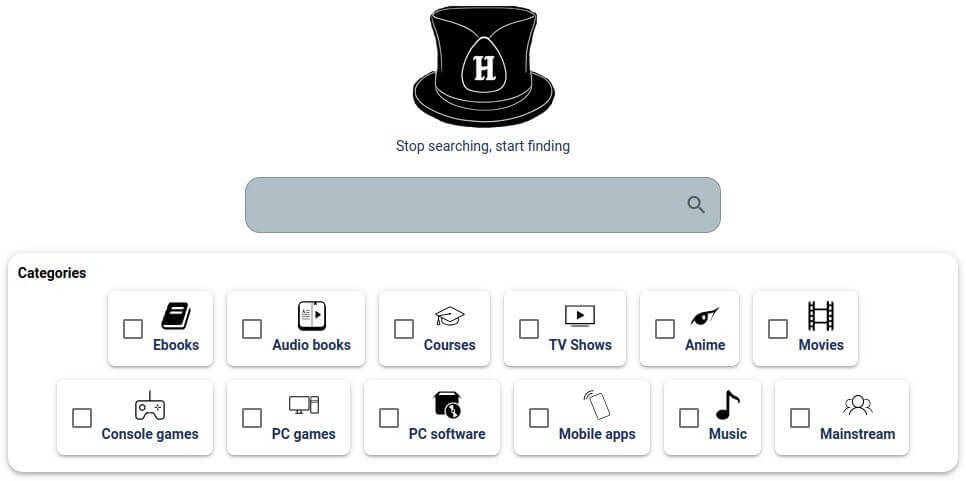

# </img> Hatt

This tool allows to search for files through multiple websites, with an intuitive user interface. Similarily to what [Jackett](https://github.com/Jackett/Jackett) does, but for DDL (direct download) and streaming.

<p align="center">
  
  
</p>
<p align="center">
  
  
</p>



If you have suggestions (new features, new sources etc.), find a bug or want to notify about something, do not hesitate to open and issue or a discussion.

<details> <summary> <b> Supported sources </b> </summary>

 * 9anime
 * 123movies
 * androeed
 * animedao
 * animepahe
 * apkmb
 * audiobookbay
 * audiobooksbee
 * audiobookslab
 * bigaudiobooks
 * bilibili
 * comicextra
 * ddlbase
 * diakov
 * dosgamesarchive
 * edgeemu
 * emugames
 * f2movies
 * filecr
 * free-mp3-download
 * galaxyaudiobook
 * game-2u
 * gamedrive
 * getcomics
 * gload
 * gog-games
 * gogoanime
 * gomovies
 * himovies
 * hotaudiobooks
 * kupdf
 * libgenli
 * library genesis (.rs)
 * lrepack
 * magazinerack
 * mobilism
 * nesgm
 * nsw2u
 * online-courses
 * openloadmov
 * ovagames
 * pdfdrive
 * rarefilmm
 * readcomicsonline
 * repackme
 * revdl
 * romulation
 * rsload
 * sflix
 * slavart
 * softarchive
 * steamrip
 * tokybook
 * trantor
 * udemy24
 * vimm
 * wawacity
 * xoxocomics
 * yourserie
 * youtube
 * zoro

</details>

## Features

- Parallel searching on many websites, all at the same time
- Custom website lists to search on
- Search on websites which require an account
- Quickly filter results with a double search
- Big and ever growing list of supported websites
- Multiple languages support
- Clean and intuitive interface
- Dark mode

## Installation

Here are the different ways you can get Hatt :

### Linux

- From the [releases tab](https://github.com/FrenchGithubUser/Hatt/releases)

- AUR : [hatt-bin](https://aur.archlinux.org/packages/hatt-bin)


### Windows

- From the [releases tab](https://github.com/FrenchGithubUser/Hatt/releases)


### MacOS

- From the [releases tab](https://github.com/FrenchGithubUser/Hatt/releases) (works on M1 chip).

- Open a terminal where hatt-macos-amd64 is located.

```
chmod +x hatt-macos-amd64
./hatt-macos-amd64
```


## Build from source

```
wails build
```

See CONTRIBUTING.md for more details

## Not Goals (to this day)

- All-in-one tool to download/stream media and display it nicely at the same time. Many softwares already do that very well ([Kodi](https://github.com/xbmc/xbmc) for movies/TV shows, [Pegasus-fe](https://github.com/mmatyas/pegasus-frontend) for games and programs, just to name a few)

- Easy "download" option. Some programs already allow to download files very well ([JDownloader](https://jdownloader.org/), [Youtube-dl](https://github.com/ytdl-org/youtube-dl), [Lux](https://github.com/iawia002/lux), just to name a few). There might be an implementation of such a feature by adding those programs as dependencies to Hatt later.

## Support

If you like Hatt, you can donate to support its development here :

Monero : 46NLLW7dzu5jo2eZ3SiAKgQuVL1Jw8wPMSBAYA3eh4h334HzwMNFSXQ3V3PmXYEoMFXkt24pTHcD1X57KRePN8ehQXn3Ggt

Bitcoin : bc1qf4a44ae76txhmfxfsa875u8mv6murdwawt7msx

Ehtereum : 0x134a0974f2fefF0F76276fBdD44439717B2b587B

[](https://ko-fi.com/W7W7JUGNI)

## Disclaimer

All the sources linked in this tool are not intended to support copyright infringement. I am not responsible for and in no way associated to any external links or their content linked , all the links available through this tool are publicly available over the internet. I have no control over the nature, content and availability of other websites. If you dislike the information this tool provides then please contact the corresponding website's owner/webmaster/hoster directly and fill a DMCA takedown request.
